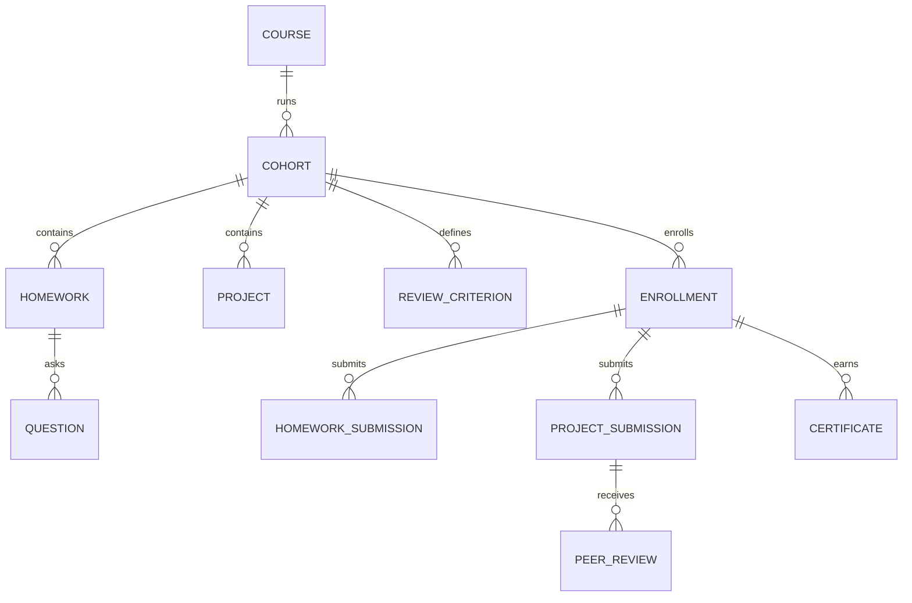

# 04 - Course-platform adoption and Course → Cohort model

Status: draft

The existing course-management platform is adopted, not reimplemented. Its Django applications, migrations, business logic, views/forms, API compatibility code, communication behavior, and tests are copied into this repository at a recorded source commit and evolved in place.

The current `Course` model is a dated delivery. The minimal structural change is to introduce a reusable parent `Course` and rename/evolve the existing edition record into `Cohort`. Homework, projects, rubrics, submissions, grading, and related operational behavior remain cohort-owned, matching today's semantics.

## Adoption baseline

At implementation start:

1. Record the exact clean source commit from `DataTalksClub/course-management-platform`.
2. Copy the maintained Django source, migrations, templates/static files, management commands, API compatibility code, and tests into this repository. Exclude local databases, secrets, build output, deployment state, notebooks unless needed, and unrelated temporary files.
3. Preserve Django app labels and migration history so the existing database can be migrated rather than exported into a greenfield schema unnecessarily.
4. Mount the existing course routes in the unified project and make the complete copied test suite pass before behavior changes.
5. Record source provenance and a repeatable file manifest so later upstream changes can be compared during the transition window.

The characterization baseline currently contains about 760 Django test methods and 48 end-to-end test methods. These tests are an asset to retain, not a reason to restate the behavior from scratch.

## Reuse policy

Reuse and refactor in place:

- learner registration/authentication/profile behavior;
- enrollment and public-display preferences;
- homework/question/answer/submission validation and scoring;
- projects, criteria, peer assignment/review, voting, scoring, results, and statistics;
- leaderboards, score breakdown, complaints, graduates, certificates, calendars, dashboards, and historical Wrapped data;
- registration campaigns and communication context;
- durable Datamailer outbox/audit logic as migration input to the unified email subsystem;
- current public/data API serializers and paths as compatibility adapters;
- `cadmin` workflows as the complete operational requirement set;
- existing migrations and fixtures.

Change deliberately:

- `Course`-as-edition becomes `Cohort` belonging to reusable `Course`;
- global `is_staff` becomes explicit site/course/cohort capabilities;
- plaintext unscoped API tokens become hashed/scoped/expiring principals;
- `cadmin` operations move behind shared services exposed by Studio and admin API;
- long scoring, exports, communications, and repairs become durable operations/jobs where needed;
- synchronous arbitrary URL validation is removed from request paths;
- ordinary destructive deletion becomes archive/cancel/protect;
- process-local cache assumptions become database/shared invalidation.

Do not replace proven scoring, peer-review, or submission logic merely to make it look like the new site's code. First wrap it with characterization tests and services; refactor only when required by the model/authorization/API boundary.

## Target model

### Course

New reusable family record:

- UUID and stable family slug;
- title, descriptions, branding, repository/docs/FAQ links, hashtag, and public state;
- default public/registration metadata that cohorts may explicitly override;
- ordered public people relationships and course-scoped staff assignments;
- no learner enrollment, submissions, score, start/end, or finished flag.

### Cohort

The evolved current `Course` edition:

- UUID plus retained legacy numeric ID mapping;
- course foreign key and globally unique cohort slug/label;
- start/end, timezone, registration window, visibility, and lifecycle;
- current scoring thresholds, completion settings, feature flags, links, and calendar namespace;
- cohort teaching team and communication settings;
- existing homework, projects, criteria, registration snapshots, enrollments, submissions, scores, and statistics.

Lifecycle: `draft -> registration_open -> active -> grading -> completed -> archived`, with `cancelled` available before completion. Existing `visible`, `finished`, and assignment states are mapped without silently changing behavior.

### Curriculum ownership

For the first consolidation release, curriculum stays cohort-owned exactly as in the current platform:

- `Homework`, `Question`, `Project`, and `ReviewCriteria` foreign keys change from legacy `Course` to `Cohort`;
- due dates, states, optional fields, scoring settings, and statistics retain current meaning;
- a new “duplicate cohort” service copies all relevant homework, questions, projects, criteria, and settings, improving on the existing partial course duplication;
- historical cohorts remain isolated because their curriculum rows are separate.

Reusable/versioned curriculum may be introduced later after consolidation, based on actual duplication pain. It is not required to satisfy `Course -> Cohort` and is intentionally excluded from the migration-critical path.

### Enrollment and certificates

- Enrollment becomes unique by learner and cohort.
- A learner may join multiple cohorts of one course without collision.
- Existing leaderboard name/visibility, certificate name, score rollups, learning-in-public controls, and timestamps remain cohort-specific.
- Certificate becomes an explicit cohort-scoped record with issued/revoked/version state while retaining legacy certificate URLs.
- Learner is derived consistently from enrollment; migration audits duplicated student/enrollment fields before new constraints are enforced.

### Registration

- A reusable registration campaign may belong to a Course.
- A registration window targets exactly one Cohort.
- A new registration requires one verified durable account and a completed, member-confirmed
  `accounts.MemberProfile`. The resumable flow is account ownership, shared profile, a
  course-specific step, then confirmation; no anonymous `CourseRegistration` is created before
  verification.
- The course-specific step identifies the course/cohort/campaign, reuses shared profile values
  without asking again, and collects only an optional course goal/comment of at most 1,000
  characters, a versioned course-registration privacy acknowledgement, and a separate optional
  unchecked newsletter/marketing consent when that integration is enabled. The comment is blank for
  every new registration. Marketing consent is never required or inferred from account, profile,
  Slack, course, or historical participation.
- Every submitted registration owns an immutable target Cohort snapshot and remains unique by
  cohort plus normalized email.
- Repointing a campaign cannot change historical registrations or prevent the same person registering for a later cohort.
- Interest collected before a cohort exists is `CourseInterest`, not a nullable/ambiguous cohort registration.

At successful registration, write one immutable, deliberately minimized shared-profile snapshot
containing only:

- profile UUID, completion schema version, profile revision, and snapshot timestamp;
- certificate/display name when present;
- member-confirmed country code and derived region;
- organization, work status, professional role, and seniority.

Alongside, and never inside, that shared-profile snapshot, the registration owns:

- its normalized verified-email snapshot;
- its target campaign/cohort snapshot;
- its course-specific comment;
- its versioned privacy-notice acknowledgement evidence; and
- its separate optional marketing-consent evidence.

Do not copy About/bio, ambitions, why-joined, or social/profile links: cohort reporting and delivery
do not need them. A later profile edit affects only future prefills and registrations. It never
rewrites an earlier shared-profile snapshot or any separate registration-owned value/evidence, and
campaign repointing never rewrites history. Legal
deletion/anonymization under the approved privacy workflow is the only exception to ordinary
immutability and leaves non-PII reconciliation evidence.

Existing `CourseRegistration` email, name, company, country/region, role, comment, and newsletter
snapshots remain migration input and are not deleted or renumbered. A blank canonical profile field
may be suggested from the most recent linked registration ordered by `created_at`, then primary key;
registration company may suggest organization. A non-empty account value always wins, conflicts are
reported, and every imported/suggested value remains unconfirmed until member submission. Historical
`accepted_newsletter` evidence is preserved even though new consent is separate and optional.

### Staff scope

Course/Cohort staff assignments support roles such as owner, instructor, grader, support, and communications operator. Studio/API services enforce global and object-scoped permissions. Public person profiles may link explicitly to staff users but do not grant access.

## Expand-and-contract model migration

The migration changes structure while keeping old code runnable in controlled steps:

1. Add a temporary `CourseFamily` parent model and nullable parent FK to the current `Course` model.
2. Generate a reviewed mapping from every edition slug to one family. Do not trust year stripping as authoritative.
3. Backfill family rows and parent links; validate every legacy course has exactly one mapping.
4. Add cohort-aware registration uniqueness and stable legacy-ID mapping tables without dropping old constraints yet.
5. Rename the legacy Python/domain `Course` model to `Cohort` and the parent to `Course`, using Django migration state/database controls to avoid unnecessary table/data recreation.
6. Mechanically retarget imports, relations, route arguments, services, templates, APIs, and tests from edition `Course` to `Cohort`.
7. Add database invariants only after preflight finds/quarantines duplicate/inconsistent submissions, answers, review pairs, criterion responses, and student/enrollment references.
8. Move public canonical routes to course/cohort paths while compatibility routes use the legacy cohort slug.
9. Remove temporary fields/aliases only after production verification and the rollback window.

Every step has forward/backward application tests against a production-like database copy.

## Preserved learner behavior

- Course/cohort discovery, active/open/archive grouping, registration, enrollment, progress badges, dashboard, and calendar.
- Homework question types, optional fields, create/update submission, answer checks, scoring, answer reveal, statistics, FAQ and learning-in-public contributions.
- Project GitHub/commit submission, required/volunteer peer review, criteria responses, assignment, voting, scoring, pass/fail, results, and statistics.
- Cohort leaderboard, breakdown, visibility preferences, complaints, graduate export, and certificate updates.
- Deadline and score/review/certificate communications.
- Historical Wrapped data remains readable in the MVP even if new Wrapped generation stays disabled.

Any intentional privacy tightening of currently public submissions/results is documented as a product/security decision, not hidden inside the structural migration.

## Studio management coverage

Existing `cadmin` and relevant Django-admin actions are ported into Studio rather than discarded:

- course and cohort create/edit/duplicate/archive/lifecycle;
- registration campaigns/windows, registrations, metrics, export, and enrollment conversion;
- enrollment lookup, edit, communication preferences, learning-in-public repair, and removal;
- homework/questions, correct-answer workflows, deadline extension, score/rescore, statistics, submission repair, and notifications;
- projects/criteria, deadline extension, peer assignment, score/rescore, statistics, submission/rubric repair, votes, and notifications;
- leaderboard recomputation and complaint resolution;
- certificate bulk issue/update/revoke/reissue;
- historical Wrapped view/recalculation if retained;
- communication template/audience/send/outbox/audit operations mapped to the unified email system;
- health/job/CloudWatch diagnostics;
- support view-as workflow with tight scope and audit.

Missing Studio functionality may temporarily retain a clearly marked compatibility `cadmin` route during migration, but production cutover requires complete Studio and admin API parity. Django admin stays break-glass only.

## APIs

Existing course API routes and schemas are copied and kept as compatibility adapters. New management capability is added through `/api/v1/admin/`; learner/public evolution uses `/api/v1/`.

Admin API covers every Studio operation, including course/cohort management, registration/enrollment, curriculum rows, submissions, peer review, scoring, statistics, complaints, certificates, communications, imports, and exports.

New mutations use scoped credentials, UUID resources, revisions/`If-Match`, idempotency keys, guarded archive/delete, per-row bulk results, and asynchronous operation resources where appropriate.

## URL consolidation and redirect Lambda

New canonical HTML routes are:

- `/courses/<course-slug>/`;
- `/courses/<course-slug>/cohorts/<cohort-slug>/`;
- cohort dashboard/calendar/homework/project/review/leaderboard/certificate routes beneath that path.

During migration, `courses.datatalks.club` continues routing to the copied compatibility views in the unified app.

After all browser links and API consumers are migrated:

- deploy a small Terraform-managed redirect Lambda for `courses.datatalks.club`;
- use an explicit generated legacy-host path map, not year stripping or a blanket homepage redirect;
- preserve path suffixes, query strings, and approved fragments/destinations;
- return one-hop `301` for GET/HEAD HTML routes;
- use `308` only for non-GET/API routes whose clients have been tested to preserve method/body/authentication across the host change;
- retain direct compatibility responses or postpone redirect for authenticated API routes when authorization would be dropped;
- monitor unknown paths before and after switch and retain a rollback target.

The Lambda stack belongs in `DataTalksClub/aws-infra` as its own small production workload and can be rehearsed on a development hostname first.

## Edge cache classes

An anonymous-stable published course catalog or course/cohort detail may use the registered public
course/event class: edge TTL 60 seconds, stale-if-error at most 5 minutes, browser
`max-age=0, must-revalidate`, and only exact allowlisted pagination in the key. Unpublished pages,
registration campaign/forms/confirmation, account/profile, enrollment, dashboard, calendar,
homework, submission, peer review, leaderboard preferences, certificates with learner state,
management, and compatibility API responses remain disabled/zero-TTL unless a later owning contract
proves an explicitly public stable representation.

Any Authorization, session/auth/CSRF or unknown credential-like cookie, preview/management token,
`Set-Cookie`, identity-sensitive navigation, learner state, PII, or unsafe/error response forces
private/no-store. A warmed anonymous catalog/detail object must never be served to a credentialed
viewer. Course registration, profile, and Slack endpoints also retain stricter application business
limits even when CloudFront/WAF limits broad traffic.

## High-risk migration checks

- Reviewed family/cohort mapping instead of regex-only slug inference.
- Compare complete homework/project/rubric/scoring definitions before any later deduplication.
- Migrate each registration from its recorded course snapshot, not a campaign's current pointer.
- Reconcile historical duplicate-email/social-account users explicitly.
- Preflight current missing database invariants before adding uniqueness constraints.
- Preserve legacy numeric IDs and calendar UIDs/aliases used by routes, exports, and subscribers.
- Drain/freeze old communication outboxes and map Datamailer list/template/idempotency keys.
- Recompute redundant scores/statistics and report unexplained differences without silently replacing them.
- Preserve historical Wrapped JSON interpretation.
- Replace synchronous external URL fetches with safe asynchronous validation.
- Lock/idempotently guard peer assignment and bulk scoring.

## Acceptance criteria

- The copied course platform passes its characterization suite before structural changes.
- One reusable Course has multiple Cohorts and a learner can enroll in more than one cohort.
- New course registration asks shared member values once, stores only the exact minimized
  shared-profile snapshot above, stores normalized email/target/comment/privacy/consent as separate
  registration-owned fields/evidence, and preserves both after profile edits or campaign
  repointing.
- Existing incomplete accounts keep prior enrollments/history and are gated only for a new
  registration; migrated values require member confirmation and historical consent evidence remains
  intact.
- Public course cache hits remain anonymous-stable while every learner/registration/private path is
  zero-TTL/no-store.
- Existing homework/project/peer-review/leaderboard/certificate behavior remains covered by ported tests.
- Model migrations upgrade a production-like database without re-creating or losing course data.
- Every current `cadmin`/relevant admin operation is mapped to Studio and admin API.
- Existing public/API paths remain functional during migration and the final Lambda redirect map is complete and one-hop.
- The old course deployment can be retired without retiring any unclassified business behavior or API consumer.
