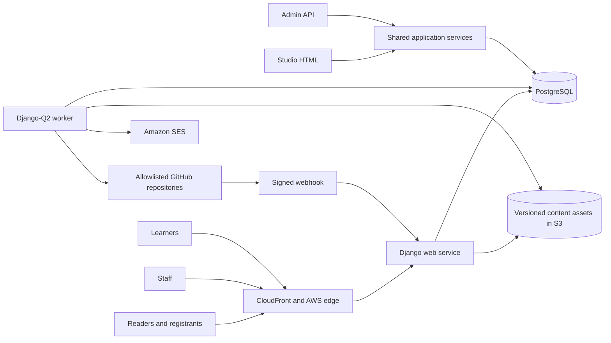

# DataTalks.Club Django specifications

Status: draft for owner review

## Outcome

Rebuild DataTalks.Club as one Django application without losing the URLs, links, content behavior, or search equity of the current sites. Integrate the existing course-management platform with an explicit `Course -> Cohort` model. Add accountless event registration, transactional email, a custom staff workspace called Studio, and an admin-only API covering every management operation.

The development environment will run at `web.dtcdev.click` in the DataTalksClub AWS sandbox account. Infrastructure will be Terraform-managed in the `DataTalksClub/aws-infra` repository and structured for later instantiation in the production account.

## Fixed requirements

- Blog, podcast, docs, FAQ, Podwiki, people, and other migrated editorial records remain authored in GitHub.
- Django serves the public site from validated, versioned database read models. Public requests never depend on a live GitHub request.
- A person profile is one canonical identity reused through relationships such as article author, podcast guest, event speaker or host, book author, and tool maintainer.
- Existing public page paths, fragments, asset paths, machine-readable endpoints, internal links, external links, and canonical URLs are preserved unless an exception has an approved one-hop redirect.
- The development site is never indexable and declares the production URL as canonical.
- Events, registrations, email delivery records, Studio configuration, redirects, and audit records are database-owned.
- The existing course platform is copied into this repository and evolved in place. Courses, cohorts, enrollments, assignments, submissions, peer review, scores, leaderboards, and certificates are database-owned and managed through Studio and the admin API.
- Studio and the admin API call the same application services and enforce the same permissions, validation, idempotency, and audit rules.
- Every management capability has both a Studio route and an admin API route; CI verifies this parity.
- Python dependency management and commands use `uv`.
- The application is deployable as separate web and worker processes with PostgreSQL.

## Recommended MVP decisions

These defaults keep the first release useful without reproducing unrelated AI Shipping Labs complexity:

- Studio inspects, previews, validates, and syncs GitHub content and links maintainers to GitHub for edits. Creating branches or pull requests from Studio is deferred.
- Existing course-platform Django code, migrations, tests, and corner-case behavior are adopted rather than reimplemented; the first model change introduces reusable Course parents for the existing cohort-like edition rows.
- Public registration is accountless. Email ownership is verified before a registration becomes confirmed.
- Capacity, waitlists, recurring events, marketing campaigns, recommendations, payments, CRM, and personalization are deferred.
- Transactional email uses Amazon SES in `us-east-1` and a durable database outbox processed by Django-Q2 workers.
- Search uses PostgreSQL in the first release while preserving the current FAQ and Podwiki public contracts.
- Staff sign-in uses an OIDC provider that enforces MFA. Authorization uses Django groups and permissions.
- The application prefers a rare duplicate transactional email over a missed critical email when a provider accepts a message but its acknowledgement is lost. Local deduplication minimizes this window.

## System shape

## Specification map

- [01 - Platform architecture](01-platform-architecture.md)
- [02 - URL, link, and SEO compatibility](02-url-link-seo-compatibility.md)
- [03 - GitHub content and people](03-github-content-and-people.md)
- [04 - Courses and cohorts](04-courses-and-cohorts.md)
- [05 - Events, registration, and email](05-events-registration-email.md)
- [06 - Studio and admin API](06-studio-and-admin-api.md)
- [07 - Security, privacy, accessibility, and operations](07-security-privacy-operations.md)
- [08 - AWS sandbox and Terraform](08-aws-sandbox-terraform.md)
- [09 - Migration, rollout, and roadmap](09-migration-rollout-roadmap.md)
- [10 - Verification strategy](10-verification-strategy.md)
- [Open decisions](open-decisions.md)

## Definition of ready for implementation

Implementation can begin after:

- the owner resolves or accepts the recommendations in [open decisions](open-decisions.md);
- every existing public surface is represented in the URL inventory design;
- Studio/API authority over each data type is explicit;
- registration verification and email behavior are approved;
- privacy retention and staff identity decisions have owners;
- the specs pass the planning critique and provenance lint.

## Non-goals

- Replacing GitHub as the editorial source of truth for the named content repositories.
- Copying AI Shipping Labs memberships, payments, plans, CRM, or AI features.
- Redesigning URLs during the Django cutover.
- Shipping new SEO experiments in the same release as the migration.
- Building native mobile applications.
- Rewriting proven course scoring, peer-review, submission, leaderboard, certificate, or learner workflows without a migration requirement.
