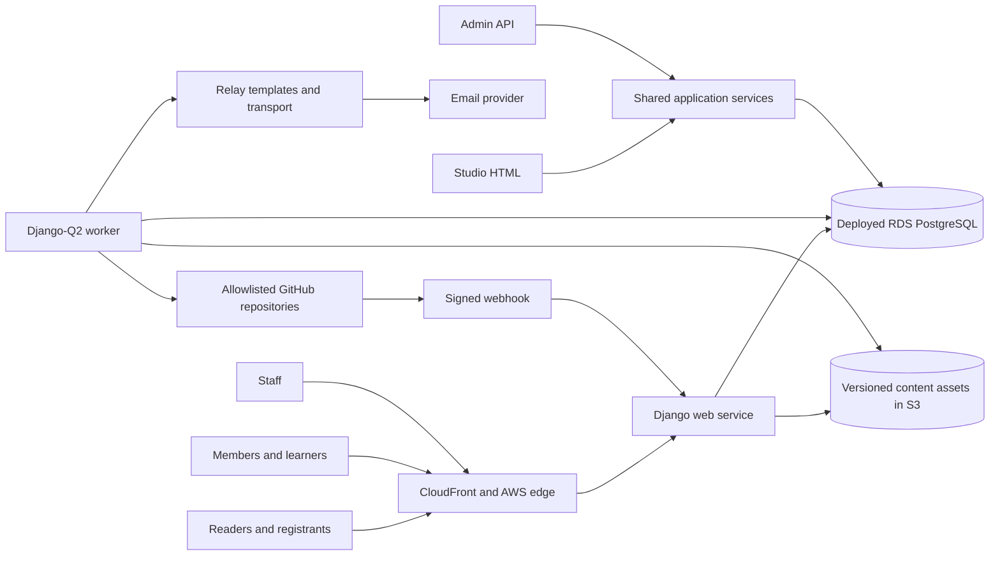

# DataTalks.Club Django specifications

Status: draft for owner review

## Outcome

Rebuild DataTalks.Club as one Django application without losing the URLs, links, content behavior, or search equity of the current sites. Integrate the existing course-management platform with an explicit `Course -> Cohort` model. Add accountless event registration, a private account-owned member profile shared by Slack onboarding and course registration, transactional email, a custom staff workspace called Studio, and an admin-only API covering every management operation.

No development environment is deployed at the moment: the `web.dtcdev.click` stack in AWS
account `817685572750` was destroyed on 2026-09-02 and its replacement `dev.datatalks.club`
is not built yet. Infrastructure is Terraform-managed in `DataTalksClub/aws-infra` and
structured for later instantiation in a separate production account. `deploy/development_target.py`
holds the reviewed development hostnames; the retired physical names are catalogued in the
[development compatibility boundary](../compatibility/development-legacy-identifiers.md).

## Fixed requirements

- Blog, podcast, docs, FAQ, Podwiki, people, and other migrated editorial records remain authored in GitHub.
- Django serves the public site from validated, versioned database read models. Public requests never depend on a live GitHub request.
- A GitHub-backed `Person` is the canonical public editorial identity reused through relationships
  such as article author, podcast guest, event speaker or host, book author, and tool maintainer. A
  private account-owned `MemberProfile` is a separate community/learner record; neither creates,
  links, synchronizes, or grants authority to the other automatically.
- Existing public page paths, fragments, asset paths, machine-readable endpoints, internal links, external links, and canonical URLs are preserved unless an exception has an approved one-hop redirect.
- The development site is never indexable and declares the production URL as canonical.
- Production `robots.txt`, sitemap output, canonicals, structured data, and all existing
  SEO-bearing editorial paths and content remain governed by the compatibility manifest. Positive
  edge caching changes freshness and cost only; it does not change indexing or content contracts.
- Events, registrations, website logical email intents/redacted Relay projections, Studio
  configuration, redirects, and audit records are database-owned.
- The existing course platform is copied into this repository and evolved in place. Courses, cohorts, enrollments, assignments, submissions, peer review, scores, leaderboards, and certificates are database-owned and managed through Studio and the admin API.
- Studio and the admin API call the same application services and enforce the same permissions, validation, idempotency, and audit rules.
- Every management capability has both a Studio route and an admin API route; CI verifies this parity.
- CloudFront caches only registry-classified anonymous public `GET`/`HEAD` responses. Private,
  authenticated, credential-shaped, personalized, learner, registration, management, search,
  operational, unsafe, and error responses fail closed to zero TTL/no-store.
- Python dependency management and commands use `uv`.
- Local development and ordinary CI use project-local, isolated SQLite databases. Application
  models, migrations, and services remain backend-portable Django code.
- The application is deployable as separate web and worker processes backed by RDS PostgreSQL;
  real-engine validation is bounded to deployment migration, readiness, and smoke checks.

## Recommended MVP decisions

These defaults keep the first release useful without reproducing unrelated AI Shipping Labs complexity:

- Studio inspects, previews, validates, and syncs GitHub content and links maintainers to GitHub for edits. Creating branches or pull requests from Studio is deferred.
- Existing course-platform Django code, migrations, tests, and corner-case behavior are adopted rather than reimplemented; the first model change introduces reusable Course parents for the existing cohort-like edition rows.
- Public event registration is accountless. Email ownership is verified before an event registration
  becomes confirmed; course registration uses the verified member account/profile flow below.
- Member signup collects only account credentials and acknowledgement before verified ownership.
  The member then completes one versioned profile, receives immediate Slack eligibility through a
  secret-stored shared join URL, and reuses confirmed values for course registration. The MVP has no
  Slack API, directory, inferred editorial Person, or manual review queue.
- Capacity, waitlists, recurring events, marketing campaigns, recommendations, payments, CRM, and personalization are deferred.
- Transactional email uses one durable website `EmailDelivery` intent and one durable Django-Q2
  job committed atomically with the owning business mutation. A leased job calls Relay only after
  commit. Relay owns canonical versioned templates, safe rendering, sender resolution, provider
  submission/lifecycle, suppression, callbacks, reconciliation, and authoritative transport state;
  the website keeps only its business intent and a redacted status projection.
- Search preserves the current FAQ and Podwiki public contracts through a backend-portable
  projection; its ranking and indexing implementation belongs to the content/search issue.
- Staff sign-in uses an OIDC provider that enforces MFA. Authorization uses Django groups and permissions.
- Provider acceptance is distinct from delivery. A lost or uncertain Relay acknowledgement becomes
  `ambiguous` and is never automatically resent; idempotent replay, reconciliation, or an audited
  operator action resolves it.
- New website code calls neither Amazon SES nor Datamailer directly. Datamailer is read-only
  migration/history/reconciliation input and receives no new sends. Until #22 approves the
  non-course purpose catalog, only the development Relay sender ID `courses` may be enabled and
  every other purpose or sender fails closed.
- CloudFront/WAF uses the cheapest currently eligible plan that supports the complete reviewed
  cache, logging, WAF, automation, and allowance contract. Advanced bot/fraud products are deferred;
  plan limits never justify weaker cache isolation, security, or evidence.

## System shape

## Specification map

- [01 - Platform architecture](01-platform-architecture.md)
- [02 - URL, link, and SEO compatibility](02-url-link-seo-compatibility.md)
- [03 - GitHub content and people](03-github-content-and-people.md)
- [04 - Courses and cohorts](04-courses-and-cohorts.md)
- [05 - Events, registration, and email](05-events-registration-email.md)
- [06 - Studio and admin API](06-studio-and-admin-api.md)
- [07 - Security, privacy, accessibility, and operations](07-security-privacy-operations.md)
- [08 - AWS development deployment and Terraform](08-aws-development-terraform.md)
- [09 - Migration, rollout, and roadmap](09-migration-rollout-roadmap.md)
- [10 - Verification strategy](10-verification-strategy.md)
- [Open decisions](open-decisions.md)

The implemented local/CI and deployed-engine boundary is recorded in
[database portability](../architecture/database-portability.md).

## Definition of ready for implementation

Implementation can begin after:

- the owner resolves or accepts the recommendations in [open decisions](open-decisions.md);
- every existing public surface is represented in the URL inventory design;
- Studio/API authority over each data type is explicit;
- accountless event-registration verification, the verified durable-account course-registration
  flow, and their email behavior are approved;
- privacy retention and staff identity decisions have owners;
- the specs pass the planning critique and provenance lint.

## Non-goals

- Replacing GitHub as the editorial source of truth for the named content repositories.
- Copying AI Shipping Labs memberships, payments, plans, CRM, or AI features.
- Redesigning URLs during the Django cutover.
- Shipping new SEO experiments in the same release as the migration.
- Building native mobile applications.
- Rewriting proven course scoring, peer-review, submission, leaderboard, certificate, or learner workflows without a migration requirement.
